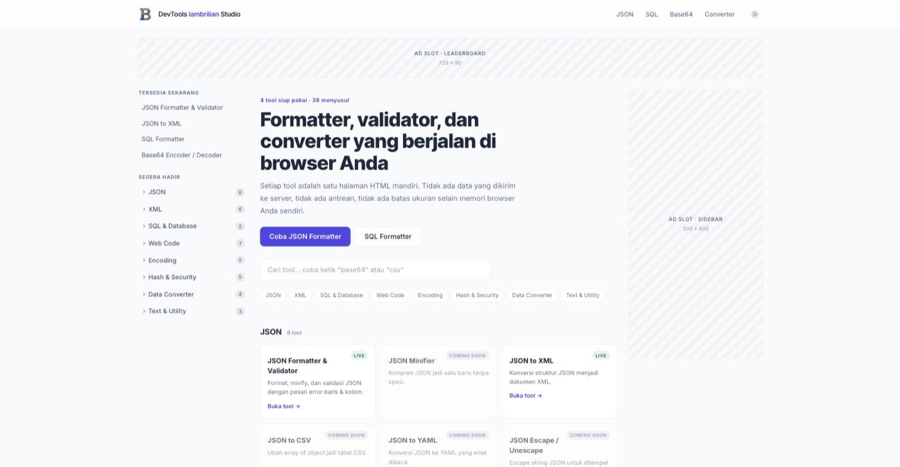
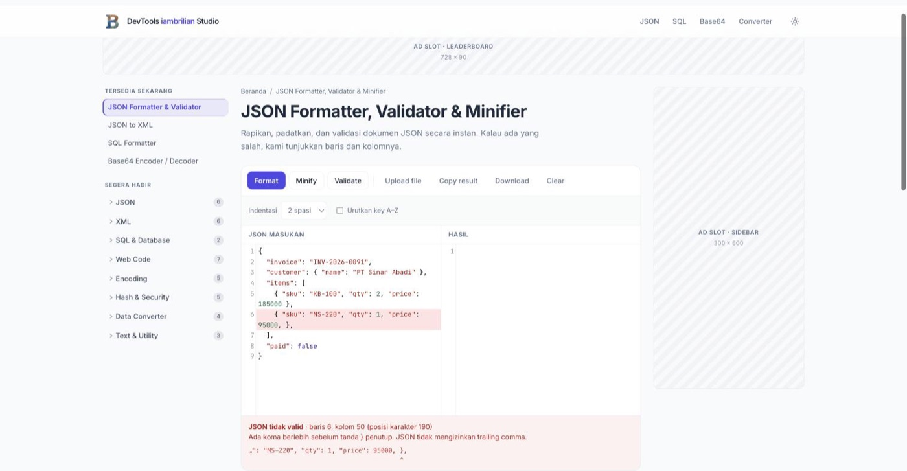
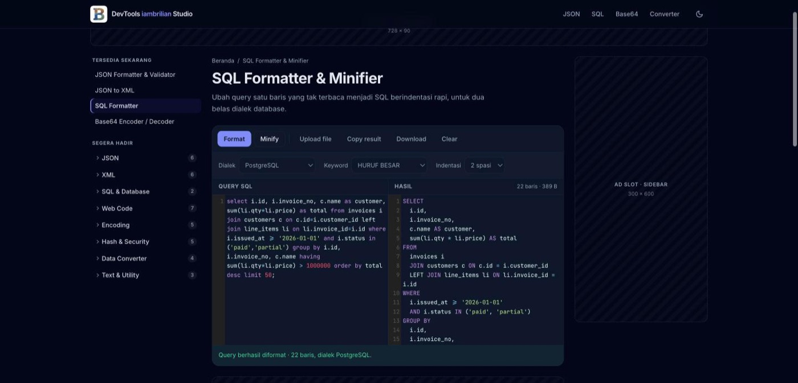
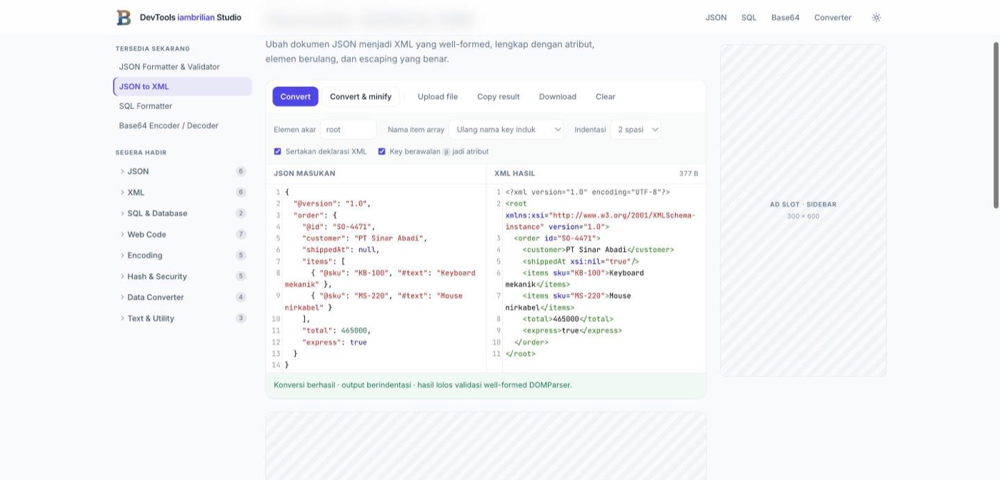
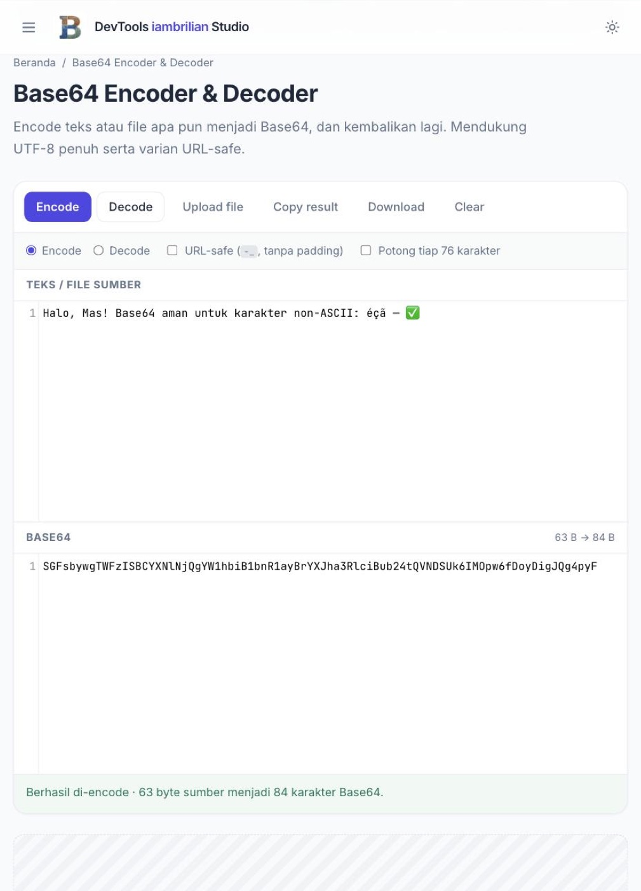
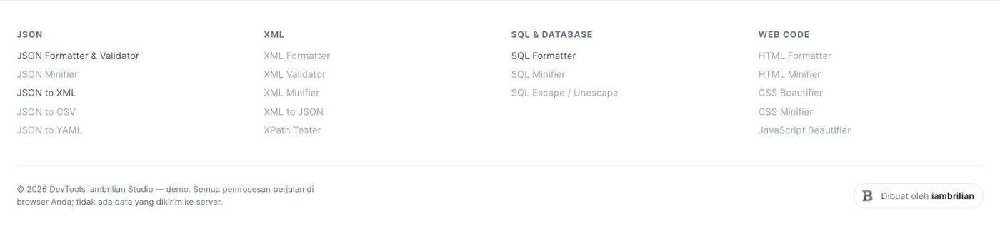
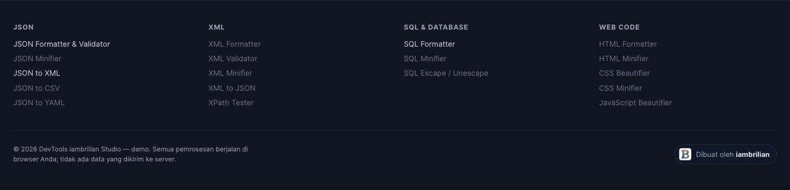

<div align="center">


# DevTools iambrilian Studio

**Kumpulan tool formatter, validator, dan converter untuk developer — seluruhnya berjalan di browser.**

Situs multi-halaman statis. HTML + vanilla JavaScript. Tanpa framework, tanpa build step, tanpa npm.

[](#arsitektur)
[](#pustaka-pihak-ketiga)
[](#menjalankan-secara-lokal)
[](#privasi)

Demo project oleh **[iambrilian](https://github.com/brilianrn)**

<br>



</div>

---

## Pratinjau

<table>
  <tr>
    <td width="50%"></td>
    <td width="50%"></td>
  </tr>
  <tr>
    <td><b>JSON Formatter</b><br>Error menyebut baris, kolom, dan sebabnya, lalu menyorot baris yang salah di editor.</td>
    <td><b>SQL Formatter</b><br>Dua belas dialek, tiga gaya penulisan keyword, dan dark mode yang tersimpan.</td>
  </tr>
  <tr>
    <td></td>
    <td></td>
  </tr>
  <tr>
    <td><b>JSON to XML</b><br>Atribut, elemen berulang, dan <code>xsi:nil</code>, diverifikasi ulang dengan DOMParser.</td>
    <td><b>Responsif</b><br>Panel menumpuk di layar sempit; toolbar dan sidebar ikut menyesuaikan.</td>
  </tr>
</table>

### Footer

Peta tool per kategori, catatan privasi, dan tanda tangan penulis yang menautkan
ke [iambrilian.vercel.app](https://iambrilian.vercel.app).





---

## Ringkasan

Empat tool sudah berjalan penuh; tiga puluh delapan sisanya sudah terpetakan dan
ditampilkan sebagai *coming soon* di homepage. Seluruh pemrosesan terjadi di
perangkat pengunjung — tidak ada backend, tidak ada unggahan, tidak ada data yang
meninggalkan browser.

| Halaman | Fungsi |
|---|---|
| `/index.html` | Homepage: navigasi per kategori, pencarian, peta 42 tool |
| `/json-formatter.html` | Format, minify, dan validasi JSON dengan pesan error baris & kolom |
| `/base64-encoder.html` | Encode / decode Base64 — aman untuk UTF-8, URL-safe, dan file biner |
| `/sql-formatter.html` | Format dan minify SQL untuk dua belas dialek |
| `/json-to-xml.html` | Konversi JSON ke XML well-formed |

Rencana lengkap 42 tool, alasan arsitektur, dan catatan migrasi produksi ada di
**[CATATAN-DEMO.md](CATATAN-DEMO.md)**.

---

## Arsitektur

Situs ini sengaja **bukan** single-page application.

Setiap tool adalah satu berkas HTML fisik, dan setiap perpindahan halaman adalah
full page reload. Tidak ada routing client-side dan tidak ada `history.pushState`.
Konsekuensinya:

- Skrip analytics dieksekusi ulang di setiap navigasi, sehingga pageview tercatat
  akurat — bukan satu kali per sesi seperti pada SPA.
- Unit iklan di-request ulang setiap halaman, sehingga impression benar-benar
  terhitung.
- Crawler menerima HTML yang sudah berisi seluruh konten, bukan shell kosong yang
  baru terisi setelah JavaScript berjalan.

Ini menjawab masalah nyata: implementasi SPA sebelumnya mencatat nol impression
AdSense dan nol trafik di Histats justru karena navigasinya tidak pernah memuat
ulang dokumen. Pembahasan lengkapnya ada di CATATAN-DEMO.md bagian 2.

### Fitur per halaman tool

- Editor input dengan syntax highlighting dan panel output terpisah (CodeMirror 5)
- Format, minify, clear, copy, download, dan upload file
- Pesan error spesifik yang menyebut baris, kolom, dan penyebabnya, lengkap dengan
  penanda baris di editor
- Dark mode yang tersimpan di `localStorage`, dibaca sebelum render untuk mencegah
  kedipan
- Sidebar navigasi antar tool, responsif sampai lebar 360px
- Tiga slot iklan kosong: leaderboard, sidebar, dan in-content
- Title, meta description, canonical, Open Graph, dan JSON-LD unik per halaman,
  ditambah deskripsi dan blok FAQ sebagai konten teks untuk diindeks

---

## Struktur folder

```
.
├── index.html
├── json-formatter.html
├── base64-encoder.html
├── sql-formatter.html
├── json-to-xml.html
├── assets/
│   ├── app.js               tema, editor, clipboard, unduh, unggah, locator JSON
│   ├── style.css            seluruh gaya kustom di luar Tailwind
│   └── logo.png · logo-192.png · logo-512.png
├── docs/preview/            tangkapan layar untuk dokumentasi
├── apple-touch-icon.png
├── favicon-32.png
├── robots.txt
├── sitemap.xml
├── vercel.json
├── README.md
└── CATATAN-DEMO.md
```

Struktur sengaja dibuat rata dan tanpa build step, sehingga seluruh isi repo bisa
langsung diunggah ke `public_html` pada shared hosting mana pun.

---

## Menjalankan secara lokal

Tidak ada dependensi yang perlu dipasang.

```bash
git clone https://github.com/brilianrn/devtools-formatter.git
cd devtools-formatter
python3 -m http.server 8899
```

Buka <http://localhost:8899/index.html>.

Membuka berkas lewat `file://` juga bisa, hanya saja tautan absolut ke `/assets/`
tidak akan ditemukan.

---

## Slot iklan

Setiap slot adalah satu elemen mandiri yang ditandai atribut data:

```html
<div class="ad-slot ad-leaderboard" data-ad-slot="leaderboard" data-ad-size="728x90" aria-hidden="true">
  <span class="ad-slot__label">Ad Slot · Leaderboard</span>
  <span class="ad-slot__size">728 × 90</span>
</div>
```

Untuk memasang AdSense, ganti kedua `<span>` di dalamnya dengan
`<ins class="adsbygoogle">`, lalu muat `adsbygoogle.js` sekali di `<head>`.
Pertahankan kelas `.ad-slot` agar tinggi minimum slot tetap terkunci dan tidak
terjadi layout shift saat iklan datang.

Penempatan: **leaderboard** di bawah header, **sidebar** sticky di kanan pada
viewport ≥ 1280px, dan **in-content** tepat di bawah area editor.

---

## Pustaka pihak ketiga

Seluruhnya dimuat lewat CDN; tidak ada yang di-vendor ke repo.

| Pustaka | Versi | Kegunaan |
|---|---|---|
| [CodeMirror](https://codemirror.net/5/) | 5.65.16 | Editor dan syntax highlighting |
| [sql-formatter](https://github.com/sql-formatter-org/sql-formatter) | 15.8.2 | Pemformat SQL dua belas dialek |
| [Tailwind CSS](https://tailwindcss.com/) | Play CDN | Utility class |

Pustaka hanya dimuat pada halaman yang membutuhkannya. `js-beautify`, `js-yaml`,
dan `PapaParse` menyusul bersama tool yang memerlukannya — pemetaannya ada di
CATATAN-DEMO.md bagian 1.

---

## Privasi

Tidak ada backend. Seluruh parsing, konversi, dan encoding dijalankan oleh
JavaScript di browser pengunjung. Isi editor tidak pernah dikirim ke jaringan,
sehingga aman dipakai untuk response API produksi, konfigurasi berisi kredensial,
atau log yang memuat data pelanggan.

---

## Catatan deployment

Tag `canonical`, `og:url`, dan `sitemap.xml` masih menunjuk ke domain sementara.
Ganti ke domain final sebelum situs dipublikasikan — cari-ganti satu string di
seluruh berkas. Detailnya ada di CATATAN-DEMO.md bagian 4.

Pada hosting produksi, routing akan dipindahkan ke PHP sesuai permintaan klien.
Sifat multi-halaman tetap dipertahankan: PHP hanya merakit HTML di sisi server,
browser tetap menerima dokumen utuh di setiap navigasi.

---

<div align="center">

Demo project oleh **[iambrilian](https://github.com/brilianrn)** · 2026

</div>
